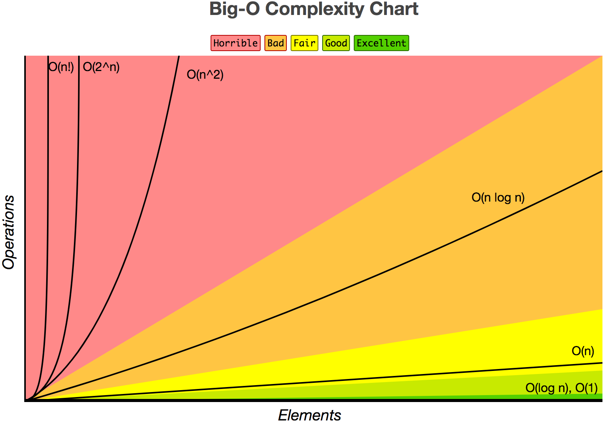

# Linked Lists

A [linked list](https://en.wikipedia.org/wiki/Linked_list) is a data structure that manages an ordered collection of data. A linked list is similar to an array, but differs in its approach to storing data. In this lesson, you'll see how this difference in approach produces unique advantages as well as disadvantages.

## Objectives

By the end of this lesson, you'll be able to:

- Explain what a linked list is.
- Explain why linked lists are important.
- Create and use a LinkedList class.
- Explain what the time and space complexities are for a linked list.

## What's a linked list?

As previously mentioned, a **linked list** is a data structure that manages an ordered collection of data. It consists of a linear collection of elements, called nodes, each containing data and a reference to the next node in the collection, if one exists.

The following is a diagram of a linked list that consists of three nodes.

```text
┌─ data ─┬─ next ─┐     ┌─ data ─┬─ next ─┐     ┌─ data ─┬─ next ─┐
│        │        │     │        │        │     │        │        │
│  'A'   │    ────┼────▶│  'B'   │    ────┼────▶│  'C'   │  null  │
│        │        │     │        │        │     │        │        │
└────────┴────────┘     └────────┴────────┘     └────────┴────────┘
```

As you can see, the above linked list consists of the following nodes.

1. The 1st node contains `'A'` in its `data` attribute and a reference to the 2nd node in its `next` attribute.
2. The 2nd node contains `'B'` in its `data` attribute and a reference to the 3rd node in its `next` attribute.
3. The 3rd node contains `'C'` in its `data` attribute and `null` in its `next` attribute because it doesn't reference another node.

In JavaScript, this linked list could be represented with the following code.

```javascript
const first = { data: 'A' };
const second = { data: 'B' };
const third = { data: 'C' };

first.next = second;
second.next = third;
third.next = null;
```

Alternatively, it could be described like this.

```javascript
const third = { data: 'C', next: null };
const second = { data: 'B', next: third };
const first = { data: 'A', next: second };
```

In a dynamically typed language, like JavaScript, a node's `data` attribute can contain any data type, such as a boolean, a number, a string, an object, an array, or even `null`. However, a node's `next` attribute can either contain `null` or a reference to the next node in the collection.

Because both linked lists and arrays maintain an ordered collection of data, a linked list can be used anywhere you would use an array. But while an array's elements are stored sequentially in memory, a linked list's nodes are stored **non-sequentially** in memory. Here's a diagram that illustrates the memory structure differences between a linked list and an array.

```text
 Linked list
┌─ data ─┬─ next ─┐     ┌─ data ─┬─ next ─┐     ┌─ data ─┬─ next ─┐
│        │        │     │        │        │     │        │        │
│  'A'   │    ────┼────▶│  'B'   │    ────┼────▶│  'C'   │  null  │
│        │        │     │        │        │     │        │        │
└────────┴────────┘     └────────┴────────┘     └────────┴────────┘

 Array
┌── 0 ───┬── 1 ───┬── 2 ───┐
│        │        │        │
│  'A'   │  'B'   │  'C'   │
│        │        │        │
└────────┴────────┴────────┘
```

Because of its node structure, a linked list has different performance characteristics than an array, which we'll study in a moment.

It's helpful to think of a linked list as a scavenger hunt. You're given the first clue, which leads you to the next clue, which leads you to the next clue, and so on until you reach the end. The following code snippet describes the process of finding the end of a linked list using a recursive function.

```javascript
const third = { data: 'C', next: null };
const second = { data: 'B', next: third };
const first = { data: 'A', next: second };

const findEnd = function(node, count) {
  if (node) {
    console.log(`Found a node that contains ${node.data}`);

    findEnd(node.next, count + 1);
  }
  else {
    console.log(`Found the end after ${count} nodes!`);
  }
};

findEnd(first, 0);
```

When the above code executes, it produces the following output.

```text
Found a node that contains A
Found a node that contains B
Found a node that contains C
Found the end after 3 nodes!
```

A linked list that consists of nodes with only one reference is called a **singly linked list**. There's another kind of linked list, called a doubly linked list, which we'll study later.

### Exercise

Turn to a neighbor and, in your own words, explain what a linked list is. Then, draw a diagram of a linked list that contains the following ordered data.

```text
Joe, Craig, Eli, Halston, Joe, DJ
```

Finally, translate your diagram into JavaScript code.

## Why are linked lists important?

As previously mentioned, a linked list can be used anywhere you would use an array, though with different performance characteristics. Specifically, a linked list allows nodes to be efficiently inserted and deleted at any position in the collection, so long as you have a suitable reference.

Let's revisit the previous linked list example. This time, imagine that a program only has access to the linked list's **head**, or first node. The following is an updated diagram of the original linked list example.

```text
        head
         │
         ▼
┌─ data ─┬─ next ─┐     ┌─ data ─┬─ next ─┐     ┌─ data ─┬─ next ─┐
│        │        │     │        │        │     │        │        │
│  'A'   │    ────┼────▶│  'B'   │    ────┼────▶│  'C'   │  null  │
│        │        │     │        │        │     │        │        │
└────────┴────────┘     └────────┴────────┘     └────────┴────────┘
```

In JavaScript, this linked list could be represented with the following code.

```javascript
let head = {
  data: 'A',
  next: {
    data: 'B',
    next: {
      data: 'C',
      next: null
    }
  }
};
```

This code more accurately represents a typical linked list because programs usually don't have references to every node in the list.

Using only the `head` reference, how would you do insert `'Z'` into the beginning of the list? Well, because nodes are objects stored non-sequentially in memory, you'd start by creating a new node that contains `'Z'` in its `data` attribute and a reference to the current `head` in its `next` attribute.

```text
                                head
                                 │
                                 ▼
┌─ data ─┬─ next ─┐     ┌─ data ─┬─ next ─┐     ┌─ data ─┬─ next ─┐     ┌─ data ─┬─ next ─┐
│        │        │     │        │        │     │        │        │     │        │        │
│  'Z'   │    ────┼────▶│  'A'   │    ────┼────▶│  'B'   │    ────┼────▶│  'C'   │  null  │
│        │        │     │        │        │     │        │        │     │        │        │
└────────┴────────┘     └────────┴────────┘     └────────┴────────┘     └────────┴────────┘
```

Then, you'd update `head` to reference the new node.

```text
        head
         │
         ▼
┌─ data ─┬─ next ─┐     ┌─ data ─┬─ next ─┐     ┌─ data ─┬─ next ─┐     ┌─ data ─┬─ next ─┐
│        │        │     │        │        │     │        │        │     │        │        │
│  'Z'   │    ────┼────▶│  'A'   │    ────┼────▶│  'B'   │    ────┼────▶│  'C'   │  null  │
│        │        │     │        │        │     │        │        │     │        │        │
└────────┴────────┘     └────────┴────────┘     └────────┴────────┘     └────────┴────────┘
```

And that's it! The above operation can be described with the following code.

```javascript
let head = {
  data: 'A',
  next: {
    data: 'B',
    next: {
      data: 'C',
      next: null
    }
  }
};

const node = { data: 'Z', next: head };
head = node;

console.log(head);
```

When the above code executes, it produces the following output.

```text
{
  data: 'Z',
  next: {
    data: 'A',
    next: {
      data: 'B',
      next: {
        data: 'C',
        next: null
      }
    }
  }
}
```

As you can see, inserting data into the beginning of a linked list takes the same number of operations regardless of how many nodes are present in the list. This means inserting data into the beginning of a linked list with only a reference to the list's `head` takes constant time or `O(1)`.

If, on the other hand, a program were to insert `'Z'` into the beginning of a JavaScript array, the process would be a little more involved. As we've previously studied, the built-in JavaScript array is in fact a dynamic array. Within a dynamic array lives a static array, which stores elements sequentially in memory and often has unused elements at the end.

Here's a diagram that shows a dynamic array that's similar to the previous linked list example and has one unused element at the end.

```text
┌── 0 ───┬── 1 ───┬── 2 ───┬────────┐
│        │        │        │        │
│  'A'   │  'B'   │  'C'   │        │
│        │        │        │        │
└────────┴────────┴────────┴────────┘
```

To insert `'Z'` into the beginning of this array, the JavaScript interpreter first copies the data, one at a time, from its old position to a new position, making space at the front of the array.

```text
       ┌───┐    ┌───┐    ┌───┐
       │   ▼    │   ▼    │   ▼
┌── 0 ───┬── 1 ───┬── 2 ───┬── 3 ───┐
│        │        │        │        │
│        │  'A'   │  'B'   │  'C'   │
│        │        │        │        │
└────────┴────────┴────────┴────────┘
```

Then, it inserts `'Z'` into the first position of the array.

```text
┌── 0 ───┬── 1 ───┬── 2 ───┬── 3 ───┐
│        │        │        │        │
│  'Z'   │  'A'   │  'B'   │  'C'   │
│        │        │        │        │
└────────┴────────┴────────┴────────┘
```

As you can see, all the existing data must be copied to a new position before the insertion can happen. Because of this, the number of operations to insert data into the beginning of an array grows linearly depending on the number of elements that are present in the array. In other words, inserting an element at the beginning of an array takes linear time or `O(n)` where `n` is the number of elements in the array.

Here's a chart that describes the difference between common Big-O complexities such as `O(1)` and `O(n)`.



**QUESTION**: How would the JavaScript interpreter handle inserting into a dynamic array that was full?

Now, you might be wondering why linked lists aren't used all the time, especially if they're so efficient at inserting data at the beginning of an ordered collection. Well, what if a program needed to access a specific node by its position and all it had was a reference to the `head` node?

For example, imagine a program needs to read the `data` attribute of the very last node. Because a linked list's nodes are stored non-sequentially in memory, the program must traverse the list like a scavenger hunt, stopping at every node until the last one is found.

Here's a diagram that describes traversing a linked list in order to read the `data` attribute of the last node.

```text
         │
         ▼
        head
         │
         ▼
┌─ data ─┬─ next ─┐     ┌─ data ─┬─ next ─┐     ┌─ data ─┬─ next ─┐     ┌─ data ─┬─ next ─┐
│        │        │     │        │        │     │        │        │     │        │        │
│  'Z'   │    ────┼────▶│  'A'   │    ────┼────▶│  'B'   │    ────┼────▶│  'C'   │  null  │
│        │        │     │        │        │     │        │        │     │        │        │
└────────┴────────┘     └────────┴────────┘     └────────┴────────┘     └────────┴────────┘
                                                                            │
                                                                            ▼
                                                                           'C'
```

**QUESTION:** How would a program know it found the last node of a linked list?

The following code snippet describes traversing a linked list in order to read the `data` attribute of the last node using a recursive function.

```javascript
let head = {
  data: 'Z',
  next: {
    data: 'A',
    next: {
      data: 'B',
      next: {
        data: 'C',
        next: null
      }
    }
  }
};

const readLastNode = function(node) {
  if (node.next) {
    return readLastNode(node.next);
  }
  else {
    return node.data;
  }
};

const data = readLastNode(head);

console.log(data);  // displays C to the console
```

As you can see, the number of operations to read the `data` attribute of the very last node grows linearly depending on the number of nodes that are present in the linked list. In other words, reading the data in the last node of a linked list takes linear time or `O(n)` where `n` is the number of nodes in the list.

On the other hand, reading the last element of an array is as simple as accessing it by its index. Because an array's elements are stored sequentially in memory, the program just performs one arithmetic operation to directly access the last element.

Here's a diagram that describes accessing the same array by an index in order to read the last element.

```text
    ───── address + index ─────┐
                               ▼
┌── 0 ───┬── 1 ───┬── 2 ───┬── 3 ───┐
│        │        │        │        │
│  'Z'   │  'A'   │  'B'   │  'C'   │
│        │        │        │        │
└────────┴────────┴────────┴────────┘
                               │
                               ▼
                              'C'
```

As you can see, it only takes one arithmetic operation to read the very last element of an array no matter how many elements are present. In other words, reading the data from the last element of an array takes constant time or `O(1)`.

Now, you might be wondering in what situations would a program need to insert, and delete, data at the beginning of an ordered collection very quickly while still traversing through the list fairly quickly. Here are a few examples from the material world as well as the immaterial world of software.

- Washing a stack of plates.
- Reading a stack of books.
- Paying a stack of bills.
- Selling a stack of tickets.
- Undoing a stack of commits in a version control system.
- Going back through a stack of URLs in a browser's history.

Notice a trend? There's another data structure, called a stack, that depends very heavily on a linked list to do its job efficiently. We'll be studying stacks in a future lesson. However, we need to become proficient with linked lists first.

### Exercise

Open your notes and, in your own words, explain why linked lists are so important. Draw diagrams for each step needed to insert data at the beginning of a linked list. Then, draw diagrams for each step needed to insert data at the beginning of an array. Describe how the two processes are different.

As a bonus, think about how you might remove data from the beginning of a linked list. How might that differ from an array? Write down your thoughts in your notes.

## How do you create and use a LinkedList class?

Now that you know what a linked list is and why it's important, let's create a `LinkedList` class and use it to perform operations on ordered data. The following table describes the methods we need to implement inside the `LinkedList` class as well as a brief description of what they need to do.

| Method        | Description                                             |
|---------------|---------------------------------------------------------|
| `constructor` | Initialize an empty linked list                         |
| `toString`    | Combine the data of a linked list into a single string  |
| `unshift`     | Insert data at the beginning of a linked list           |
| `get`         | Read the data from a specific position in a linked list |

**NOTE:** The `unshift` method has a funny name because it's the opposite of shifting data off the front of things like an ordered collection or a binary number.

To get started, open your text editor, create a file called `linkedList.js` and type the following code.

```javascript
class LinkedList {
  constructor() {
    this.length = 0;
    this._head = null;
  }
}
```

Now, create another file called `test.js` and type the following code.

```javascript
const LinkedList = require('./linkedList');

const ll = new LinkedList();

console.log(`length: ${ll.length}`);
```

From the Terminal, run the `test.js` file using Node.js.

```shell
node test
```

And you should see the following output.

```text
length: 0
```

Once that's working, update the `linkedList.js` file with the following code.

```javascript
class LinkedList {
  // ...

  toString() {
    if (!this._head) {
      return '';
    }

    let current = this._head;
    let result = [];

    while (current) {
      result.push(current.data);

      current = current.next;
    }

    return result.join(',');
  }
}
```

Then, update the `test.js` file with the following code.

```javascript
// ...

console.log(`string: ${ll.toString()}`);
```

Run the `test.js` file again and you should see the following additional output.

```text
string:
```

Once that's working, update the `linkedList.js` file with the following code.

```javascript
class LinkedList {
  // ...

  unshift(value) {
    this.length += 1;

    const node = { data: value, next: this._head };

    this._head = node;

    return value;
  }
}
```

Then, update the `test.js` file with the following code.

```javascript
// ...

ll.unshift('C');

console.log(`length: ${ll.length}`);
console.log(`string: ${ll.toString()}`);

ll.unshift('B');

console.log(`length: ${ll.length}`);
console.log(`string: ${ll.toString()}`);

ll.unshift('A');

console.log(`length: ${ll.length}`);
console.log(`string: ${ll.toString()}`);
```

Run the `test.js` file again and you should see the following additional output.

```text
length: 1
string: C
length: 2
string: B,C
length: 3
string: A,B,C
```

Once that's working, update the `linkedList.js` file one more time.

```javascript
class LinkedList {
  // ...

  get(key) {
    if (key < 0 || key >= this.length) {
      return;
    }

    let current = this._head;
    let index = 0;

    while (current) {
      if (key === index) {
        return current.data;
      }

      current = current.next;
      index += 1;
    }
  }
}
```

Then, update the `test.js` file with the following code.

```javascript
console.log(`index 0: ${ll.get(0)}`);
console.log(`index 1: ${ll.get(1)}`);
console.log(`index 2: ${ll.get(2)}`);

console.log(`index 3: ${ll.get(3)}`);
console.log(`index -1: ${ll.get(-1)}`);
```

Run the `test.js` file again and you should see the following additional output.

```text
index 0: A
index 1: B
index 2: C
index 3: undefined
index -1: undefined
```

### Exercise

Turn to a neighbor and peer review their implementation of the `LinkedList` class. What's similar about their work? What's different?

As a bonus, see if you can implement a `shift` method that removes data from the beginning of a linked list. What will your `shift` method return?

## What are the time and space complexities for a linked list?

Before using the above `LinkedList` class to store an ordered collection of data in a real program, it's important to understand the performance characteristics of its methods as measured in both time and space. Let's start by analyzing its `constructor` method.

```javascript
class LinkedList {
  constructor() {
    this.length = 0;
    this._head = null;
  }
}
```

As you can see, initializing an empty linked list always takes two assignment operations. Since the amount of time and space required is always the same, the `constructor` method's time and space complexities are both constant or `O(1)`.

Next, let's analyze its `toString` method.

```javascript
class LinkedList {
  // ...

  toString() {
    if (!this._head) {
      return '';
    }

    let current = this._head;
    let results = [];

    while (current) {
      results.push(current.data);

      current = current.next;
    }

    return results.join(',');
  }
}
```

After careful examination, it's clear that the major sections of the `toString` method are the number of `while` iterations and the length of the `results` array, and therefore the number of `join` iterations. The following table describes the relation between each of these sections as compared to the number of nodes in the linked list.

| Nodes | `while` iterations | `results` length | `join` iterations |
|------:|-------------------:|-----------------:|------------------:|
|     0 |                  0 |                0 |                 0 |
|     1 |                  1 |                1 |                 1 |
|     2 |                  2 |                2 |                 2 |
|     3 |                  3 |                3 |                 3 |
|     4 |                  4 |                4 |                 4 |

As you can see from the table, there's a linear relationship between the number of nodes in a linked list, the number of `while` iterations, the length of the `results` array, and the number of `join` iterations.

Because the `while` iterations and the `join` iterations are not nested, the total time complexity is `O(n + n) = O(2n) = O(n)`. And because the length of the `results` array grows linearly, the space complexity is `O(n)` as well.

### Exercise

In your `linkedList.js` file, add comments about the time and space complexities of the `constructor` and `toString` methods. For example:

```javascript
class LinkedList {
  // Time: O(1)
  // Space: O(1)
  constructor() {
    this.length = 0;
    this._head = null;
  }
}
```

Then, analyze the time and space complexities of the `unshift` and `get` methods. When you've worked them out, add comments above the `unshift` and `get` methods with their respective complexities.

As a bonus, perform the same analysis on the `shift` method, if you have one.

## References

- [Big-O Cheatsheet](http://bigocheatsheet.com/)
- [Wikipedia: Linked list](https://en.wikipedia.org/wiki/Linked_list)
